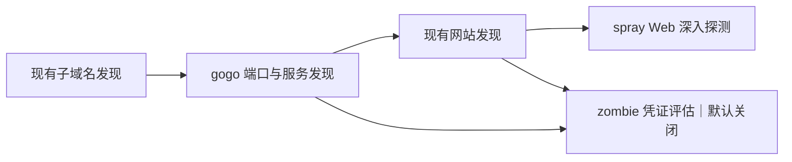

# LunaFox 接入 gogo、spray、zombie 的扫描工作流方案

状态（2026-09-28）：三个 Engine Package 已安装到开发环境，`chainreactor` 内置工作流已同步到现有工作流页面。Agent 已分别执行 gogo、spray、zombie，Server 收到 HostPort、Website 和 AuthFinding 结果。尚需认证发现的查询界面、生产凭据保护、zombie 速率控制、许可证确认、双架构正式发布与更完整的失败/取消验收。

## 1. 目标和交付形态

新增一个独立的 `chainreactor` 内置扫描工作流，保留现有 `default` 工作流。开发环境已经把相同拓扑同步到现有工作流页面。工作流把 ChainReactor 的三个工件封装成三个 LunaFox 第一方 Engine：

| Engine ID | 工件 | 职责 | 默认启用 |
| --- | --- | --- | --- |
| `engine.lunafox.gogo_scan` | gogo | 端口、服务与可用于后续探测的指纹发现 | 是 |
| `engine.lunafox.spray_scan` | spray | 对当前扫描发现的网站做目录与路径深入探测 | 是 |
| `engine.lunafox.zombie_audit` | zombie | 对已确认的服务做凭证暴露评估 | 否，操作人显式启用 |

三个工件保留各自的版本、配置、结果解析和失败边界。LunaFox Server 负责编排及结果验证，Agent 负责容器生命周期，Engine 容器才与目标交互。新工作流复用现有 `subdomain_discovery` 与 `website_discovery`，确保域名发现和网站 URL 输入都有可靠来源。

这是一条按 Stage barrier 运行的确定性工作流。现有 Workflow 只描述有序 Stage/Step，不能表示“每发现一个服务立即触发一个下游任务”的事件驱动 DAG；首版依照已最终化的阶段结果传递数据。

## 2. 当前契约与实现缺口

- `extensions/workflows/default.scan-workflow.json` 展示了现有 Stage/Step 定义。Workflow 定义只放 `engineId` 与 `profileDefaultEnabled`，不放工具参数；参数留在各 Engine `engine.json` 及 Scan 配置中。
- `contracts/engineapi/README.md` 和 `engine-go` 定义 Engine API v2：生成的 Go Facade 读取 Target、输入、配置与资源；业务代码运行工具、解析输出并提交 typed Results。
- 已新增 `security.auth_finding.v1`，并在 Server 按 Scan 快照存储脱敏的认证发现。HostPort 只有 `host/ip/port`，因此当前 zombie 只消费 WebsiteURLs 中可确认的 HTTP(S) origin。
- 当前漏洞结果 `contracts/results/vulnerability.go` 限定 `source=nuclei`，且 `rawOutput` 会持久化；不能把 zombie 输出伪装成 Nuclei 漏洞或把明文口令塞入该字段。
- `server/internal/modules/scan/application/README.md` 说明 `scanSnapshot` 与 `targetInventory` 两种输入来源。此工作流的默认执行配置应显式选择 `scanSnapshot`，以使用同一次 Scan 的已最终化结果，而非执行中变化的目标历史资产。
- `NOTICE-CLOSED-ARTIFACTS.md` 明确把闭源范围限定在 Agent；Engine Runtime Image、Engine Package 和 Server 属于公开边界。使用现有 Engine API v2 输入角色接入三个工件，不需要私有 Agent 源码。新增认证结果类型属于公开 Server/结果契约开发；只在引入 Agent 必须物化的新输入角色或受保护资源，或实测发现当前 Agent 不兼容时，才需要评估私有 Agent 改动。

## 3. 工作流拓扑

现有 `/scan/config/engines/` 页面负责安装不可变 OCI Engine Package，`/scan/config/workflows/` 页面负责工作流编排；扫描发起表单已有工作流选择及扫描配置。`extensions/workflows/chainreactor.scan-workflow.json` 已随开发 Server 镜像加载，并在页面显示为内置工作流。Server 启动同步会检查每个 Step 引用的 Engine 已安装，部署时须先安装三个 Engine Package。

| Stage | Step | 输入 | 产出 |
| --- | --- | --- | --- |
| `discovery` | 现有 `subdomain_discovery` | Domain Target | Subdomains；IP/CIDR Target 按现有适用性规则跳过 |
| `network` | `gogo_scan` | Target、当前 Scan 的 Subdomains | HostPorts；服务证据先在 Engine 内验证，跨 Engine 传递方案另行验收 |
| `websites` | 现有 `website_discovery` | 当前 Scan 的 HostPorts | WebsiteURLs/Website 资产 |
| `deep_probe` | `spray_scan` | 当前 Scan 的 WebsiteURLs | Directories；可明确映射的 Endpoint/Website 观察 |
| `deep_probe` | `zombie_audit` | 当前 Scan 的 WebsiteURLs；仅 HTTP(S) origin | AuthFindings（已写入 Scan 快照，查询界面待补） |

`deep_probe` 中的两个 Step 相互独立，可以在同一 Stage 执行。`zombie_audit` 的 `profileDefaultEnabled=false`；即使工作流被选中，也必须由操作人在本次 Scan 中开启。首次版本不把它加入无人值守的定时扫描默认配置。对 Domain/IP/CIDR 的适用性由各 Engine `supportedTargetTypes` 声明，并在 Scan 创建时按现有规则编译冻结计划。

## 4. 三个 Engine 的职责

### 4.1 gogo_scan

1. 从 `Execution.Target` 与 `Execution.Input.Subdomains.Path(ctx)` 构造候选。仅扫描目标授权范围；CIDR 展开、候选数、端口集合、速率与时限在启动进程前受明确上限约束。
2. Runtime Image 内固定 gogo 二进制、模板版本和校验摘要。当前已验证的命令行只提供有限的端口集合、线程数与超时配置，不暴露任意命令行字符串；gogo v2.15.0 没有独立的请求速率参数，若产品要求精确限速，需在 Engine 调度层增加节流后再开放该配置。
3. 解析 gogo 的结构化输出，逐条校验目标归属。开放端口写入现有 `asset.host_port.v1`；可确认的非 Web 服务写入新增 `asset.service_endpoint.v1`。服务名通过版本化映射表转换为 zombie 支持的插件名；未识别或证据不足的服务仅保留端口发现。HTTP/HTTPS 结果须先经网站发现保留 Host/SNI 等域名绑定证据，不能仅凭共享 IP 上的开放端口生成面向域名的认证目标。
4. 首版不启用 gogo 的漏洞 PoC，避免与 Nuclei 的任务边界重叠；凭证探测交给 zombie。gogo 的指纹详情先保存为受限、无敏感信息的服务证据字段；更丰富的关联分析另行设计。

### 4.2 spray_scan

1. 请求当前 Scan 已最终化的 `WebsiteURLs` 输入，在 Engine Workspace 内生成目标文件。零网站是成功的零结果，不从历史库存隐式补目标。
2. Runtime Image 固定 spray 版本。参数提供受限字典资源、请求速率、并发、超时、递归与过滤策略；字典沿用现有不可变 digest 绑定与校验流程。
3. 使用 spray 的 JSON 文件输出解析有效结果，映射 `asset.directory.v1` 所需的 URL、状态码、长度、类型和时长。只有确实满足 Endpoint/Website 契约的观察才提交其他结果类型；不能把所有 spray 字段直接塞入 Directory。
4. 保留工具自身的过滤判定统计用于任务诊断；不要将大量响应正文或目标敏感信息写入普通进度日志。对异常输出、超时和取消采用与现有 FFUF Engine 一致的清晰终态语义。

### 4.3 zombie_audit

1. 首轮使用现有 `HostPorts` 与 `WebsiteURLs` 输入角色：zombie Engine 在尝试认证前对候选做明确的服务确认，Web 目标保留域名与 Host/SNI 绑定；不从端口号猜协议，也不依赖上游容器的临时 `.dat` 文件。跨 Engine `ServiceEndpoints` 可作为后续优化，不能作为首轮接入的前置条件。
2. 用户在 Scan 配置中明确选择服务集合、账户来源、口令资源、每账户/每服务尝试上限、全局速率、并发和超时。开发环境可以用隔离测试账户与测试口令验证现有普通资源路径；普通可下载 Wordlist 不承载真实生产口令。生产凭据评估如需受保护资源，再评估 Agent 物化链路。官方 zombie CLI 未提供可靠的“只检测匿名访问且绝不尝试口令”开关，因此在明确选定凭据模式前，不把 CLI 扫描称作纯匿名检测。缺少可靠服务证据时跳过候选，零候选为成功的零结果。
3. 输出新增 `security.auth_finding.v1`：目标端点、服务、发现类型（匿名访问或有效凭证）、账户标识、验证时间和脱敏证据。首版只保存可用于处置的元数据，不在普通结果、RawOutput、进度、错误、日志或导出中保存明文口令。若产品要求后续读取成功口令，须另设加密的 Secret 存储、单独权限、访问审计与保留期限，再启用该能力。
4. 认证尝试应受到目标范围、总量、速率与停止条件约束，并支持任务取消。先在自有测试环境验证每种协议的成功、失败、锁定与匿名访问判定，再逐一开放服务插件。

## 5. 新数据契约与协议改动

### ServiceEndpoint（后续可选）

若首轮运行后确需跨 Engine 复用已确认服务证据，可新增 `asset.service_endpoint.v1`，建议字段为 `host`、`ip`、`port`、`transport`、`service`、`source`、`observedAt` 和可审计的证据摘要。它既有 Scan snapshot，也有 Target 当前资产投影；唯一键至少覆盖 Target/`ip`/`port`/`transport`/`service`。Server 校验 Target 范围、端口、服务枚举与字段长度。该优化不能成为使用现有 WebsiteURLs 完成 Web 认证测试的前置条件。

首轮复用现有只读 `HostPorts`、`WebsiteURLs` 输入角色。`scanSnapshot` 读取本次 Scan 的最终化记录，`targetInventory` 读取当前 Target 记录；两条路径都执行 Scan 黑名单快照过滤。输入缺失或不完整时在 Engine 启动前失败，不降级成猜测端口或读取其他 Scan 的结果。新增 `ServiceEndpoints` 角色属于可选的后续协议优化。

### AuthFinding

新增 `security.auth_finding.v1` 的 typed Result、Scan snapshot、持久化模型、列表/详情与权限边界。结果只描述已验证的认证暴露，不复用 `asset.vulnerability.v1`。按 `(Scan, endpoint, service, findingType, account)` 去重，Server 验证目标归属与允许的服务类型；账户标识按敏感字段处理，默认列表应遮盖。无成功结果仍是成功完成的扫描，不产生“未发现即安全”的结论。

新增结果类型已更新公开 Server、结果 Registry、Engine Facade 与镜像/Package。开发环境的已发布 Agent 镜像已无改动转发 `security.auth_finding.v1`，Scan 7 的 1 条结果已获确认并写入 `auth_finding_snapshot`。正式引入受保护凭据资源时仍须评估 Agent 支持与协议版本。

## 6. 发布、信任与配置

- 采用 LunaFox 自己维护的三个适配 Engine。ChainReactor 工件是镜像内固定版本的工具依赖，不把上游二进制或上游项目直接声明为拥有 LunaFox Result 权限的第三方 Engine。
- 每个 Engine 有独立 `engine.json`、Dockerfile、Go 业务代码、生成 Facade、镜像 conformance 和 Engine Package v2。完整发布同时覆盖 `linux/amd64` 与 `linux/arm64`，记录工具来源、摘要、SBOM、许可证与归属。
- Server 安装 Engine Package 后登记 Engine；内置 Workflow `chainreactor` 由公开 definition 在 Server 启动时同步。默认工作流保持原样。
- 三个上游仓库的许可证与依赖归属在镜像发布前逐一核对，保留相应 notices。当前公开仓库是发布投影，涉及 Agent 与受保护发布流水线的改动须在对应权威源码中完成。

已从对应官方 Release 的 checksum 文件核对的 Linux 工件 SHA-256；开发环境仅构建并验证了 arm64 镜像，正式双架构发布仍待完成：

| 工件版本 | linux/amd64 | linux/arm64 |
| --- | --- | --- |
| gogo v2.15.0 | `3b51080a909023f7d484e2443740b572307ce0054eb9e32d98f0a06bfcd2db90` | `f34e248bc1d0f8e18101655850082b9f48f5f9f5a102cbac107086f3798c20a9` |
| spray v0.3.2 | `5e6c778790a93c79110394a1c43f8d1902e20c69f5f03e544347fda7cf9863e8` | `907185fc9cacae2b0040a96e183d0893201bb2f194d32fdd73eeb6851d7dd03d` |
| zombie v1.3.0 | `94cc277b812d5b056984fb2206d32d9911791feea7a0dc811c2b196a82666325` | `0bb305893e0639cd74fe4918782f8724e96a0ef97bba590f10f7c9ff0f4fc5c7` |

## 7. 实施顺序与验收

已落地三工件 Runtime 业务层、Engine API v2 Facade、双语 locale、Dockerfile、镜像容器测试、`security.auth_finding.v1` 及 Server 快照迁移。开发环境的 arm64 Runtime Image 与 Package v2 已构建、校验并安装；gogo、spray 的包版本为 0.1.1，修复 Profile 默认配置后的 zombie 包版本为 0.1.2。`chainreactor` 内置工作流已显示在现有工作流页面。Scan 6 验证了 gogo → 网站发现 → spray：端口和网站各 1 条，spray 正常结束且目录结果为 0；Scan 7 在隔离 Basic Auth 服务上验证了 gogo → 网站发现 → zombie，Agent 已确认 1 条 AuthFinding，数据库只保存 URL、服务、类型和账户，不保存密码。spray 的字典配置需填写规范资源名（如 `wordlists/1`），不可直接填文件名。gogo v2.15.0 必须显式加 `-C` 才得到明文 JSON Lines；spray 输出含站点基线记录，Directory 映射会剔除；zombie JSON 含明文密码，解析后只提交脱敏结果。公开投影缺少原有 Facade 生成器，当前使用仓库中的 `tools/chainreactor-facade-gen` 生成可重复的适配代码。zombie 上游仓库当前未声明可识别的 LICENSE，镜像对外分发前须确认授权。

| 阶段 | 交付 | 通过条件 |
| --- | --- | --- |
| A. 契约 | 先复用 HostPorts/WebsiteURLs 与现有资源角色；补 AuthFinding 的公开 Server schema、Target scope 校验和快照；用测试凭据验证 Agent 现有结果转发能力 | 新旧 Engine 的兼容矩阵明确；输入空值、缺失、越界与重复的结果确定 |
| B. gogo | `gogo_scan` Engine 与独立 Package | 自有 Domain/IP/CIDR 测试目标上的端口和服务证据可重复；误识别服务不会触发 zombie |
| C. spray | `spray_scan` Engine 与独立 Package | 当前 Scan 的 WebsiteURLs 能传递；有效/无效目录、零结果、超时和取消均有正确终态 |
| D. zombie | `zombie_audit` Engine 与 AuthFinding 展示 | 仅显式启用后发生认证尝试；明文口令不进入数据库普通结果、API、日志或导出；限速与停止条件生效 |
| E. 工作流与发布 | `chainreactor` 内置 Workflow、Profile 默认值、双架构镜像及 Package | 按 Stage barrier 运行三工件；新 Scan 冻结配置；旧 `default` 工作流和历史 Scan 不改变 |

端到端验收使用授权的隔离测试环境，包括至少一个普通 Web 服务、一个可被 spray 识别的路径、一个已知服务与测试账户。记录输入候选数、各结果类型计数、被过滤数、失败原因、执行耗时和工具版本。验证 Agent 断线、取消、重试、结果批次确认及回滚时，已经确认写入的结果不会被静默删除或重复归属。

## 8. 依据

- LunaFox：`contracts/engineapi/README.md`、`contracts/results/registry.go`、`server/internal/modules/scan/application/README.md`、`server/internal/engineinstall/README.md`、`extensions/README.md`、`NOTICE-CLOSED-ARTIFACTS.md`。
- ChainReactor：[gogo 入门](https://www.chainreactors.ai/gogo/start/)、[spray 入门](https://www.chainreactors.ai/spray/start/)、[zombie 设计](https://www.chainreactors.ai/zombie/design/)、[zombie 入门](https://www.chainreactors.ai/zombie/start/)。
